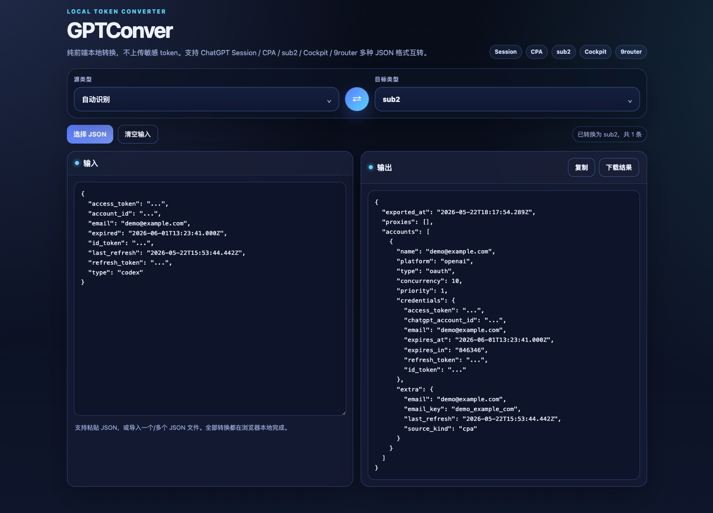

# GPTConver

GPTConver 是一个纯前端本地 token JSON 转换工具，用于在 ChatGPT Session、CPA、sub2、Cockpit、9router 等格式之间互转。



## 功能特性

- 纯浏览器本地转换，不上传敏感 token。
- 支持自动识别源 JSON 类型，也可以手动指定源类型。
- 支持输出为 sub2、CPA、Cockpit、9router 格式。
- 支持粘贴单个 JSON、JSON 数组，或选择一个/多个 JSON 文件导入。
- 支持复制转换结果和下载转换后的 JSON 文件。

## 支持格式

| 类型 | 说明 |
| --- | --- |
| Session | ChatGPT Session 导出的会话 JSON |
| CPA | `access_token` / `refresh_token` / `id_token` 等字段格式 |
| sub2 | sub2 的 `accounts` 文档或单账号 `platform: openai` 配置 |
| Cockpit | Cockpit 常见 token JSON 格式 |
| 9router | `providerSpecificData` 结构的 9router token JSON |

## 使用方式

1. 打开页面后，在「源类型」选择自动识别或指定格式。
2. 在「目标类型」选择需要导出的格式。
3. 粘贴 JSON 内容，或点击「选择 JSON」导入文件。
4. 转换结果会自动显示在右侧输出区。
5. 点击「复制」复制结果，或点击「下载结果」保存为 JSON 文件。

## 本地运行

```bash
npm run dev
```

构建静态文件：

```bash
npm run build
```

构建结果会输出到 `dist/` 目录。

## Docker

项目包含 `Dockerfile`，可按需构建镜像并部署静态页面。

```bash
docker build -t gptconver .
```

## 安全说明

GPTConver 的转换逻辑在浏览器本地执行，输入内容不会主动上传到服务器。仍建议只在可信环境中使用，并妥善保管转换后的 token 文件。
